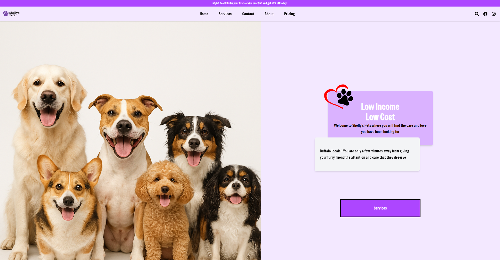

# Shelly's Pets

**Shelly's Pets** is a beautiful and responsive landing page for a local dog grooming business based in Buffalo, NY. This site showcases the services offered, builds trust with potential clients, and provides a simple contact form to get in touch — all built with **React**, **Vite**, and **Tailwind CSS**.



## Features

- Responsive, mobile-friendly layout
- Clean and modern design
- Simple contact form powered by [EmailJS](https://www.emailjs.com/)
- Built with fast and modern tools

## Tech Stack

- **React** – Component-based frontend framework
- **Vite** – Lightning-fast development environment
- **Tailwind CSS** – Utility-first styling
- **EmailJS** – Send email directly from the frontend

## Getting Started

### Prerequisites

- Node.js (v16 or higher)
- npm or yarn

### Installation

1. Clone the repository:

   ```bash
   git clone https://github.com/your-username/shellys-pets.git
   cd shellys-pets
   ```

2. Install Deps

```
npm install
# or
yarn install

```

3. Create an .env file in the root with your EmailJS credentials:

```
VITE_EMAILJS_SERVICE_ID=your_service_id
VITE_EMAILJS_TEMPLATE_ID=your_template_id
VITE_EMAILJS_USER_ID=your_user_id

```

4. Start the dev server

```
npm run dev
```

## Deployment

You can deploy this site with platforms like Vercel, Netlify, or any static hosting provider. Run:

```
npm run build
```

Then upload the contents of the dist folder to your host.

## Contact

Feel free to reach out if you have questions or suggestions:

Website: shellyspets.com

Email: info@shellyspets.com

## License

This project is open source and available under the MIT License

See License [LICENSE](./LICENSE)
